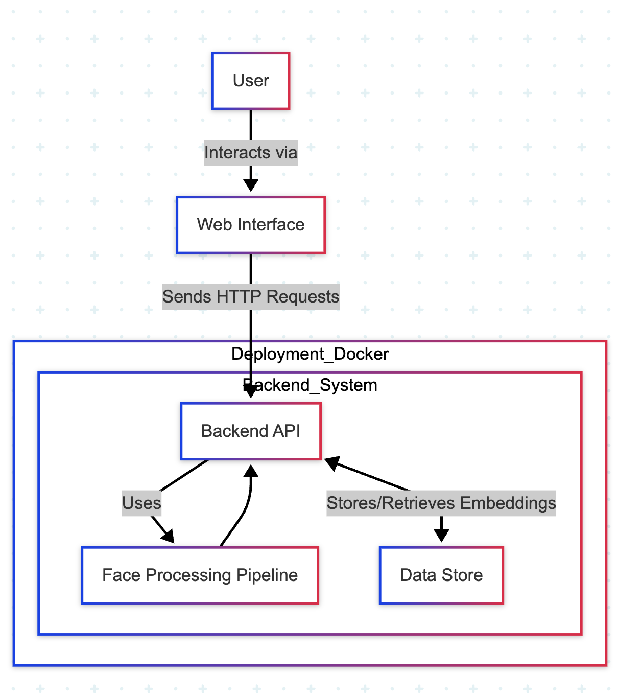

# System Design Overview

This document provides an overview of the architecture and design choices for the Facial Recognition System.

## System Architecture Components and Interaction Flow

### Components

The system follows a layered architecture with the following main components:

*   **Frontend:** A simple web interface built with HTML, CSS, and JavaScript. It runs in the user's browser and provides a user-friendly way to interact with the system's functionalities (register, verify, identify, list/manage users). It communicates with the backend API using standard HTTP requests (`fetch` API in JavaScript).
*   **Backend API:** Developed using FastAPI. This is the core application server. It receives requests from the frontend (or other clients), handles API key authentication and rate limiting, orchestrates the face processing pipeline, and interacts with the data store.
*   **Face Processing Pipeline:** This internal part of the backend handles the computer vision tasks. It consists of:
    *   Face Detection: Using the MTCNN model to locate faces within an input image and return bounding box coordinates.
    *   Face Preprocessing: Taking the detected face region, resizing it to a standard input size (160x160 for FaceNet), converting color channels, and normalizing pixel values.
    *   Embedding Generation: Using the pre-trained FaceNet model to generate a high-dimensional numerical vector (embedding) that represents the unique features of the preprocessed face.
*   **Data Store:** Redis is used as the database to persistently store the face embeddings. Each embedding is associated with a `user_id` as a key.

### Interaction Flow

Here is the typical flow of interaction within the system:

1.  The User interacts with the Frontend (Web Interface).
2.  The Frontend sends HTTP requests (e.g., for registration, verification, identification) to the Backend API.
3.  The Backend API receives the request and, for image-related tasks, utilizes the Face Processing Pipeline.
4.  The Face Processing Pipeline performs face detection, preprocessing, and embedding generation.
5.  The Backend API then interacts with the Data Store (Redis) to either store new embeddings (registration) or retrieve and compare existing embeddings (verification, identification).
6.  For other requests (/debug/registered-users, /users/{user_id}, /unregister/{user_id}), the Backend API interacts directly with the Data Store (Redis) to list, retrieve status for, or delete user embeddings.
7.  Finally, the Backend API sends a JSON response back to the Frontend, which then updates the UI to display the result or any errors.

*Note: Docker Compose is used to containerize and manage both the Backend API and Redis services, allowing them to communicate over a virtual network.*

## Backend Choice: Why FastAPI?

FastAPI was chosen for the backend due to several key advantages that are particularly beneficial for this application:

*   **High Performance:** FastAPI is built on top of Starlette (for web handling) and Pydantic (for data validation), making it one of the fastest Python frameworks available. This is important for an application that might handle potentially computationally intensive tasks related to image processing and embedding generation, ensuring the API remains responsive.
*   **Fast Development Speed:** FastAPI's intuitive design, automatic data validation and serialization (powered by Pydantic models), and automatic interactive API documentation (Swagger UI/ReDoc) significantly accelerate the development process. Defining endpoints and request/response schemas is straightforward.
*   **Asynchronous Support:** FastAPI fully supports `asyncio`, allowing endpoints to be defined with `async def`. This is crucial for efficiently handling I/O-bound operations like reading uploaded files, interacting with the Redis database, and potentially making calls to external services without blocking the entire application server.
*   **Python Type Hinting:** FastAPI is built around standard Python type hints. This improves code readability, maintainability, and allows for excellent editor support (autocompletion, type checking).
*   **Dependency Injection:** The built-in dependency injection system (used for things like the API key verification with `Depends`) makes it easy to manage components and enforce requirements for endpoints.
*   **Static File Serving:** FastAPI provides a simple way to serve static files (`StaticFiles`), which is convenient for hosting the HTML, CSS, and JavaScript of the web interface directly from the backend server.

In the context of a microservice-oriented application like this API, FastAPI's focus on building clear, high-performance APIs with great developer experience makes it a strong choice.

## System Architecture Diagram

This diagram provides a high-level overview of how the different parts of the system fit together and interact.